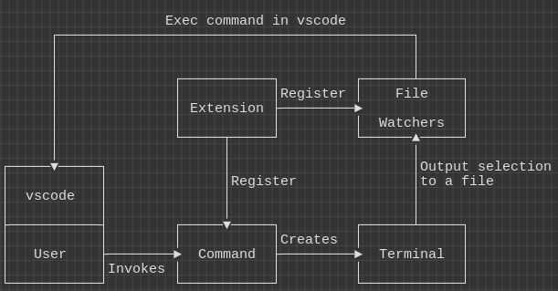
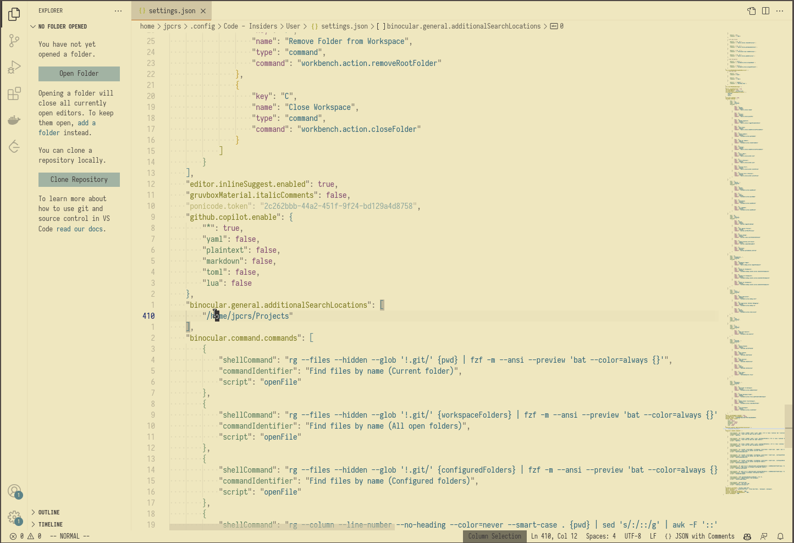
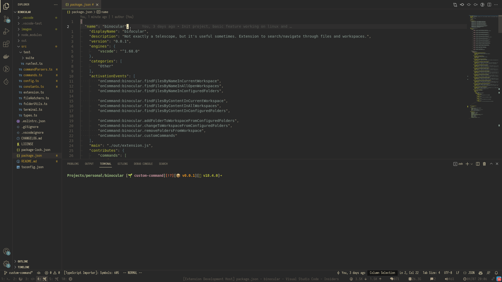
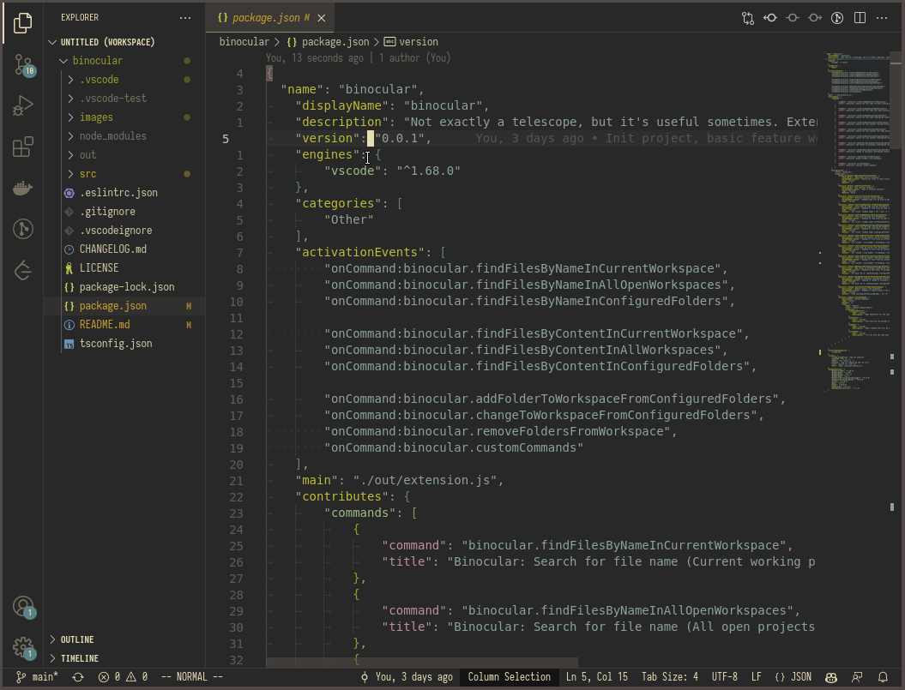

<p>
    <h1 align="center">Binocular</h1>
</p>

> Not as useful as a telescope, but helps in some situations.

- [What's Binocular?](#whats-binocular)
- [How does it work](#how-does-it-work)
- [Dependencies](#dependencies)
- [Default Commands](#default-commands)
    - [Search file by name](#search-by-file-name)
    - [Search file by content](#search-by-file-content)
    - [Manage Workspace folders](#manage-workspace-folders)
- [Creating Shortcuts](#create-shortcuts)
- [External Terminal](#external-terminal)
- [Custom Commands](#custom-commands)
- [Current Problems](#current-problems)

## What's Binocular?
`Binocular` is an extension to improve the file navigation and workspace management in VSCode. Inspired by [Telescope](https://github.com/nvim-telescope/telescope.nvim).

Important: The code isn't tested or extensible enough to make this a serious extension. I just created this to help my current workflow whenever I have to use vscode. There's no guarantee to work for other people :).

### Motivation?
My RSI.

## How does it work?
Binocular register **commands** and **file-watchers** during startup, a command contains a **shell instruction** to be executed in a terminal and a **file** to receive the output. The **file-watchers** listen to those files and interacts with the vscode api whenever there's new input in the files.



## Dependencies
All default commands can be configured/modified, so there's no hard dependencies to run the plugin, but the default shell commands configuration have a set of dependencies, they're:
- [ripgrep](https://github.com/BurntSushi/ripgrep)
- [fzf v0.30.0](https://github.com/junegunn/fzf)
- [fd](https://github.com/sharkdp/fd) (**Important**: On Debian distros fd binary is actually called `fdfind`, but the default config uses `fd`. Create a Symbolic link `fd` or change the settings to `fdfind`).
- [bat](https://github.com/sharkdp/bat)
- [sed](https://www.gnu.org/software/sed/) / ([sed for windows](http://gnuwin32.sourceforge.net/packages/sed.htm#:~:text=Sed%20(streams%20editor)%20isn',and%20outputs%20the%20modified%20text.))
- [awk](https://www.gnu.org/software/gawk/) / ([awk for windows](http://gnuwin32.sourceforge.net/packages/gawk.htm))


## Default Commands

- ## Search by file name


- ## Search by file content


- ## Manage workspace folders


Binocular comes with a set of pre-configured commands, but they can be updated if you want, for example, switch from [fzf](https://github.com/junegunn/fzf) to [sk](https://github.com/lotabout/skim), or [rg](https://github.com/BurntSushi/ripgrep) to [ag](https://github.com/ggreer/the_silver_searcher)

The default commands can be updated in the settings.json file, the default values are:
``` json
[
    {
        "shellCommand": "rg --files --hidden --glob '!.git/' {pwd} | fzf -m --ansi --preview 'bat --color=always {}' --bind shift-up:preview-page-up,shift-down:preview-page-down",
        "commandIdentifier": "Find files by name (Current folder)",
        "script": "openFile"
    },
    {
        "shellCommand": "rg --files --hidden --glob '!.git/' {workspaceFolders} | fzf -m --ansi --preview 'bat --color=always {}' --bind shift-up:preview-page-up,shift-down:preview-page-down",
        "commandIdentifier": "Find files by name (All open folders)",
        "script": "openFile"
    },
    {
        "shellCommand": "rg --files --hidden --glob '!.git/' {configuredFolders} | fzf -m --ansi --preview 'bat --color=always {}' --bind shift-up:preview-page-up,shift-down:preview-page-down",
        "commandIdentifier": "Find files by name (Configured folders)",
        "script": "openFile"
    },
    {
        "shellCommand": "rg --column --line-number --no-heading --color=never --smart-case . {pwd} | sed 's/:/::/g' | awk -F '::' '{ print $1\"::\"$2\"::\"($2-30 >= 0 ? $2-30 : 0)\"::\"$2+30\"::\"$3\"::\"$4 }' | fzf -m --delimiter :: --ansi --preview 'bat --color=always {1} --highlight-line {2} --line-range {3}:{4}' --bind shift-up:preview-page-up,shift-down:preview-page-down",
        "commandIdentifier": "Find files by content (Current folder)",
        "script": "openFileAndJumpToLine"
    },
    {
        "shellCommand": "rg --column --line-number --no-heading --color=never --smart-case . {workspaceFolders} | sed 's/:/::/g' | awk -F '::' '{ print $1\"::\"$2\"::\"($2-30 >= 0 ? $2-30 : 0)\"::\"$2+30\"::\"$3\"::\"$4 }' | fzf -m --delimiter :: --ansi --preview 'bat --color=always {1} --highlight-line {2} --line-range {3}:{4}' --bind shift-up:preview-page-up,shift-down:preview-page-down",
        "commandIdentifier": "Find files by content (All open folders)",
        "script": "openFileAndJumpToLine"
    },
    {
        "shellCommand": "rg --column --line-number --no-heading --color=never --smart-case . {configuredFolders} | sed 's/:/::/g' | awk -F '::' '{ print $1\"::\"$2\"::\"($2-30 >= 0 ? $2-30 : 0)\"::\"$2+30\"::\"$3\"::\"$4 }' | fzf -m --delimiter :: --ansi --preview 'bat --color=always {1} --highlight-line {2} --line-range {3}:{4}' --bind shift-up:preview-page-up,shift-down:preview-page-down",
        "commandIdentifier": "Find files by content (Configured folders)",
        "script": "openFileAndJumpToLine"
    },
    {
        "shellCommand": "fd .git$ -td -H --absolute-path {configuredFolders} | {sedRemoveGitFromString} | fzf -m",
        "commandIdentifier": "Add git project to workspace (Configured folders)",
        "script": "addFolderToWorkspace"
    },
    {
        "shellCommand": "fd .git$ -td -H --absolute-path {configuredFolders} | {sedRemoveGitFromString} | fzf",
        "commandIdentifier": "Change another git project (Configured folders)",
        "script": "changeToWorkspace"
    },
    {
        "shellCommand": "echo {workspaceFoldersLineBreak} | fzf -m",
        "commandIdentifier": "Remove folders from workspace",
        "script": "removeFromWorkspace"
    }
]
```

Binocular exposes some placeholder methods that can be used in the configuration. Currently they're:
- `{pwd}`: Gets the current folder depending on the OS currently in use. On `Windows` it'll use `%cd%`, on all other platforms `$(pwd)`.
- `{workspaceFolders}`: All the workspace folders currently open in vscode, separated by whitespace.
- `{configuredFolders}`: All the folders in the `binocular.general.additionalSearchLocations` configuration, separated by whitespace.
- `{workspaceFoldersLineBreak}`: All the folders currently open in vscode, separated by linebreak (Currently used for input in fzf).
- `{sedRemoveGitFromString}`: sed command to `.git` from the string, we use this to pipe our `fd` into `fzf` after searching for git projects.
- `{sedReplaceSkipDelimiter}`: sed command to update `rg` delimiters from `:` to `::`. On windows it skips the first occurance (`C:/..`).

Currently the default methods/scripts that can be used are:
- `openFile`: Receives a full file path and opens the file on vscode.
- `openFileAndJumpToLine`: Receives `{fullfilepath}::{line to jump to}`, opens the file and jump to the line.
- `addFolderToWorkspace`: Adds the folder to the workspace
- `changeToWorkspace`: Change to the workspaces (Will reload all the vscode host)
- `removeFromWorkspace`: Removes the folder from workspace

## External Terminal
VSCode integrated terminal has some rendering performance problem, it uses a lot of resources when there's too much information being re-rendered quickly. It's possible to force the execution of the shell commands in an external shell.

By default, the command to invoke an external terminal is based on the Operating System in use.

- **Linux**: `x-terminal-emulator -- sh -c "#"`
- **macOS**: `osascript -e 'tell app "Terminal" to do script "ls" & activate & do script "#;exit"`
- **Windows**: `start cmd /k "# & exit /s"`

The command can be overwriten using the `binocular.command.externalTerminalCustomCommand` config. An `#` is used as placeholder to choose where the actual shell command will be replaced.




## Create shortcuts
The only command that the library register is `binocular.executeCommand`. Since we have to choose which command we actully want to execute, we have to send the `commandIdentifier` as an arg to it. You have to set it manually in the `keybindings.json` file (`Preferences: Open Keyboard Shortcut (JSON)`).

Example of shortcut to find files by name:
```
    {
        "key": "alt+f",
        "command": "binocular.executeCommand",
        "args": "Find files by name (Current folder)"
    },
```

## Custom Commands
First: Yup, this has to be improved.

It's possible to create your own commands in the `binocular.command.commands` configuration.

The `script` can be any pre-defined method or point to any .ts file that has the following signature: `async function customFunction(data, vscode, terminal)`.

- #### Example:
<details>
<summary>This is an extension that fetches the git log and let's you checkout the git hash.</summary>
<br>

`settings.json` file:
```
"binocular.command.customCommands": [
    {
        "shellCommand": "git-fuzzy-log", // Command that will be executed on shell, in this case, it's a bash script in my PATH.
        "commandIdentifier": "Git Fuzzy Log", // Command identifier, it'll be shown in the list in case the `customCommands` command is invoked without any parameter.
        "script": "/home/user/bin/git-fuzzy-log.ts" // Typescript file with a method signature that will be invoked.
    }
]
```

- `keybindings.json` file:
```
{
    "key": "alt+l",
    "command": "binocular.executeCommand",
    "args": "Git Fuzzy Log"
}
```

- `git-fuzzy-log` file:
```shell
GIT_FZF_DEFAULT_OPTS="
	$FZF_DEFAULT_OPTS
	--ansi
	--bind shift-down:preview-down
	--bind shift-up:preview-up
	--bind pgdn:preview-page-down
	--bind pgup:preview-page-up
	--bind q:abort
	$GIT_FZF_DEFAULT_OPTS
"

PREVIEW_COMMAND='f() {
  set -- $(echo -- "$@" | grep -o "[a-f0-9]\{7\}")
  [ $# -eq 0 ] || (
    git show --no-patch --color=always $1
    echo
    git show --stat --format="" --color=always $1 |
    while read line; do
      tput dim
      echo " $line" | sed "s/\x1B\[m/\x1B\[2m/g"
      tput sgr0
    done |
    tac | sed "1 a \ " | tac
  )
}; f {}'

git log --graph --color=always --format="%C(auto)%h %s%d " | \
  fzf ${GIT_FZF_DEFAULT_OPTS} --no-sort --tiebreak=index \
  --preview "${PREVIEW_COMMAND}" --preview-window=right:70 | \
  grep -o "[a-f0-9]\{7\}"
```

- `/home/user/bin/git-fuzzy-log.ts` file:
```typescript
async function customFunction(data, vscode, terminal) {
    data = data.split('\n')[0].trim();
    const gitExtension = vscode.extensions.getExtension('vscode.git')?.exports;
    const api = gitExtension.getAPI(1);

    const repo = api.repositories[0];
    repo.checkout(data);
    terminal.dispose();
}
return await customFunction;
```

Result when using the `alt+l` shortcut:


</details>

## Current Problems
- Tests :)
- Apparently Powershell startup is really slow.
- Dirty approach to change the delimiter to `::` so it makes my life easier hardcoding `const fileInfo = file.split('::');`.
- Terrible way of invoking custom scripts, but lazy to change.