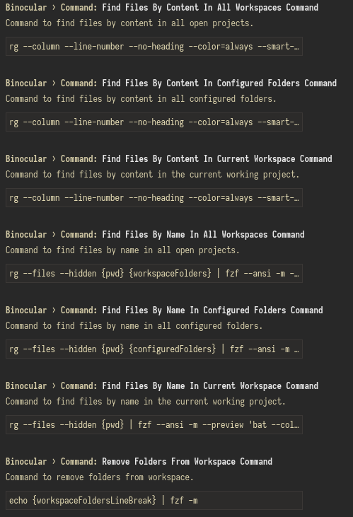
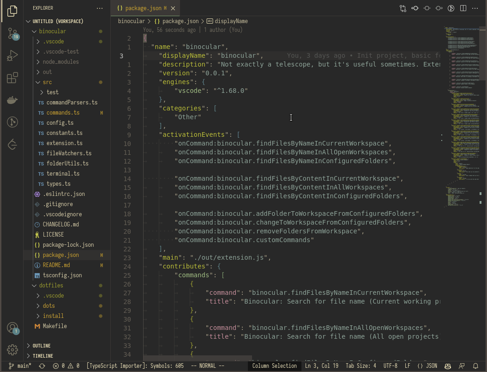
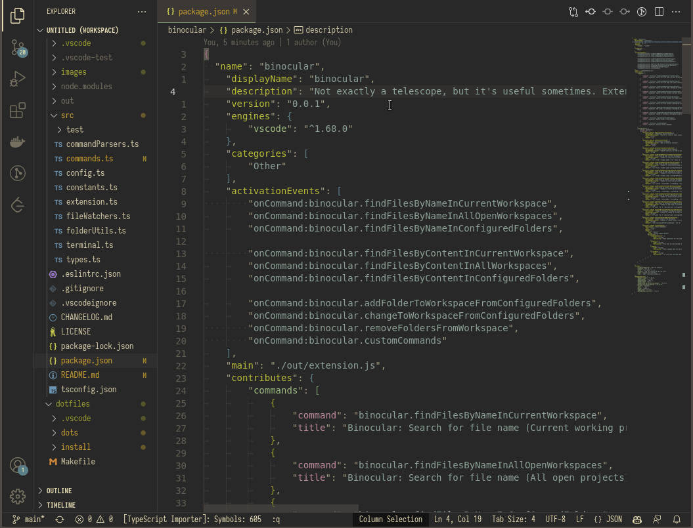
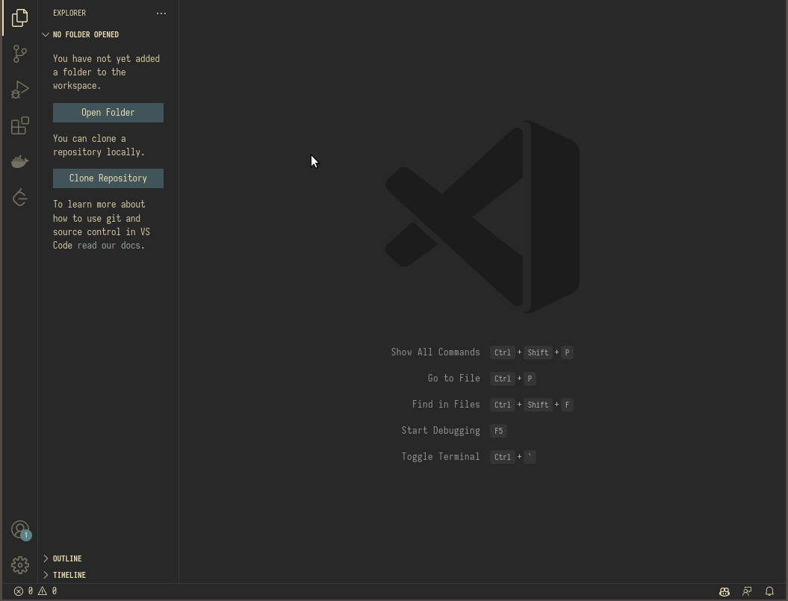
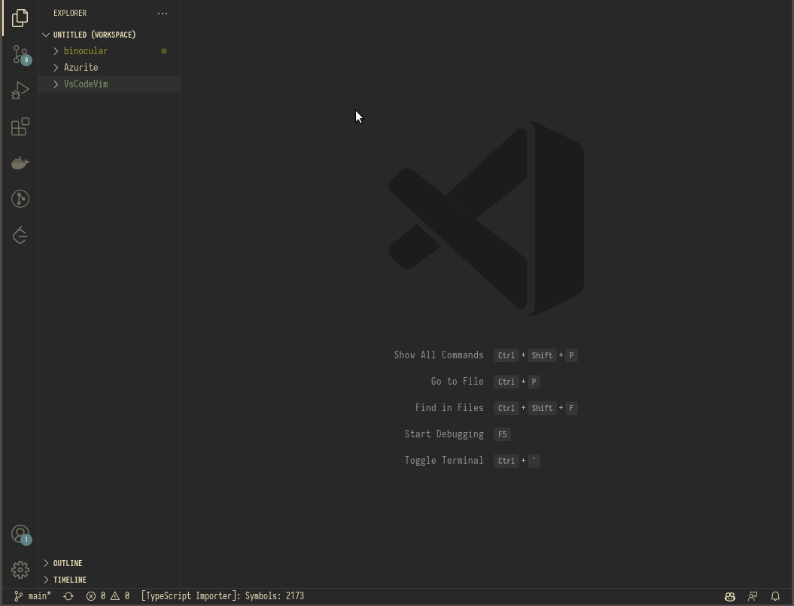
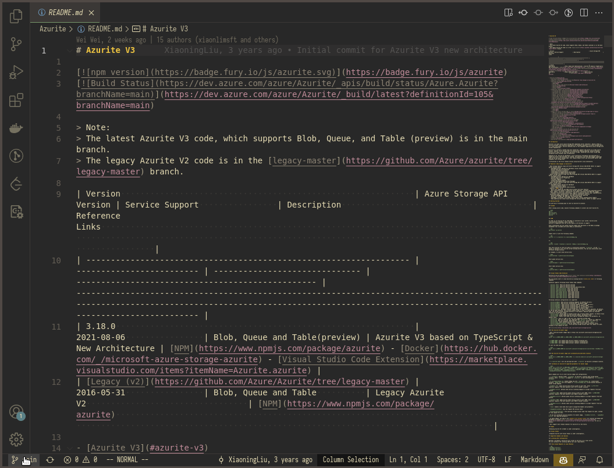

<p>
    <h1 align="center">Binocular</h1>
</p>

> Not as useful as a telescope, but helps in some situations.

- [What's Binocular?](#whats-binocular)
- [How does it work](#how-does-it-work)
- [Dependencies](#dependencies)
- [Default Commands](#default-commands)
    - [Search file by name](#search-by-file-name)
        - [binocular.findFilesByNameInCurrentWorkspace](#binocularfindfilesbynameincurrentworkspace)
        - [binocular.findFilesByNameInAllWorkspaces](#binocularfindfilesbynameinallworkspaces)
        - [binocular.findFilesByNameInConfiguredFolders](#binocularfindfilesbynameinconfiguredfolders)
    - [Search file by content](#search-by-file-content)
        - [binocular.findFilesByContentInCurrentWorkspace](#binocularfindfilesbycontentincurrentworkspace)
        - [binocular.findFilesByContentInAllWorkspaces](#binocularfindfilesbycontentinallworkspaces)
        - [binocular.findFilesByContentInConfiguredFolders](#binocularfindfilesbycontentinconfiguredfolders)
    - [Add/remove folder to/from workspace](#add-or-remove-folder-from-workspace)
        - [binocular.addFolderToWorkspaceFromConfiguredFolders](#binocularaddfoldertoworkspacefromconfiguredfolders)
        - [binocular.removeFoldersFromWorkspace](#binocularremovefoldersfromworkspace)
    - [Change to workspace](#change-to-workspace)
        - [binocular.changeToWorkspaceFromConfiguredFolders](#binocularchangetoworkspacefromconfiguredfolders)
- [External Terminal](#external-terminal)
- [Custom Commands](#custom-commands)

## What's Binocular?
`Binocular` is an extension to improve the file navigation and workspace management in VSCode. Inspired by [Telescope](https://github.com/nvim-telescope/telescope.nvim).

## How does it work?
Binocular register `commands` and `file-watchers` during startup, a command contains a `shell instruction` to be executed in a terminal and a `file` to receive the output. The `file-watchers` listen to those files and interacts with the vscode api whenever there's new input in the files.

## Dependencies
All default commands can be configured/modified, so there's no hard dependencies to run the plugin, but the default shell commands configuration have a set of dependencies, they're:
- [ripgrep](https://github.com/BurntSushi/ripgrep)
- [fzf v0.30.0](https://github.com/junegunn/fzf)
- [fd](https://github.com/sharkdp/fd)
- [bat](https://github.com/sharkdp/bat)
- [sed](https://www.gnu.org/software/sed/) / ([sed for windows](http://gnuwin32.sourceforge.net/packages/sed.htm#:~:text=Sed%20(streams%20editor)%20isn',and%20outputs%20the%20modified%20text.))


## Default Commands
Binocular have a set of default commands built-in, but the actual shell command that will be executed in the terminal can be configured, in case you want to, for example, switch from [ripgrep](https://github.com/BurntSushi/ripgrep) to [sk](https://github.com/lotabout/skim).

The shell commands can be changed in vscode settings.



Binocular exposes some placeholder methods that can be used in the configuration. Currently they're:
- `{pwd}`: Gets the current folder depending on the OS currently in use. On `Windows` it'll use `%cd%`, on all other platforms `$(pwd)`.
- `{workspaceFolders}`: All the workspace folders currently open in vscode, separated by whitespace.
- `{configuredFolders}`: All the folders in the `binocular.general.additionalSearchLocations` configuration, separated by whitespace.
- `{workspaceFoldersLineBreak}`: All the folders currently open in vscode, separated by linebreak (Currently used for input in fzf).

- ## Search by file name


- #### `binocular.findFilesByNameInCurrentWorkspace` 
    - Find files by name in the workspace of the file that is open in VSCode. Example: If there's 4 workspace folders open in vscode and you're editing a file that belongs to workspace1, it'll just search for files that belongs to. 
    - **Default command executed**: `rg --files --hidden {pwd} | fzf --ansi -m --preview 'bat --color=always {}'`
---
- #### `binocular.findFilesByNameInAllWorkspaces`
    - Find files by name in all the workspaces currently open. 
    - **Default command executed**: rg --files --hidden {pwd} {workspaceFolders} | fzf --ansi -m --preview 'bat --color=always {}'
---

- #### `binocular.findFilesByNameInConfiguredFolders` 
    - Find files by name in all the pre-configured folders (binocular.general.additionalSearchLocations). 
    - **Default command executed**: rg --files --hidden {pwd} {configuredFolders} | fzf --ansi -m --preview 'bat --color=always {}'
---
<br>

- ## Search by file content


- #### `binocular.findFilesByContentInCurrentWorkspace` 
    - Find files by content in the workspace of the file that is open in VSCode. Example: If there's 4 workspace folders open in vscode and you're editing a file that belongs to workspace1, it'll just search for files that belongs to. 
    - **Default command executed**: rg --column --line-number --no-heading --color=always --smart-case . {pwd} | fzf -m --delimiter : --bind 'change:reload:rg --column --line-number --no-heading --color=always --smart-case {q} $(pwd) || true' --ansi --preview 'bat --color=always {1} --highlight-line {2}'
---
- #### `binocular.findFilesByContentInAllWorkspaces` 
    - Find files by content in all the workspaces currently open. 
    - **Default command executed**: rg --column --line-number --no-heading --color=always --smart-case . {pwd} {workspaceFolders} | fzf -m --delimiter : --bind 'change:reload:rg --column --line-number --no-heading --color=always --smart-case {q} $(pwd) {workspaceFolders} || true' --ansi --preview 'bat --color=always {1} --highlight-line {2}'

---
- #### `binocular.findFilesByContentInConfiguredFolders` 
    - Find files by content in all the pre-configured folders (binocular.general.additionalSearchLocations). 
    - **Default command executed**: rg --column --line-number --no-heading --color=always --smart-case . {pwd} {configuredFolders} | fzf -m --delimiter : --bind 'change:reload:rg --column --line-number --no-heading --color=always --smart-case {q} $(pwd) {configuredFolders} || true' --ansi --preview 'bat --color=always {1} --highlight-line {2}'
---
<br>

- ## Add or remove folder from workspace


- #### `binocular.addFolderToWorkspaceFromConfiguredFolders` 
    - Search for all folders that contains a `.git` folder inside and add to the workspace (it just searches in the binocular.general.additionalSearchLocations to avoid bloat). 
    - **Default command executed**: fdfind .git$ -td -H --absolute-path {configuredFolders} | sed 's/\\/.git//g' | fzf -m
---
- #### `binocular.removeFoldersFromWorkspace` 
    - List all the open workspaces and let you remove them. 
    - **Default command executed**: echo {workspaceFoldersLineBreak} | fzf -m
---
<br>

- ## Change to workspace

- #### `binocular.changeToWorkspaceFromConfiguredFolders` 
    - Search for all folders that contains a `.git` folder inside and change to the workspace (it just searches in the binocular.general.additionalSearchLocations to avoid bloat). 
    - **Default command executed**: fdfind .git$ -td -H --absolute-path {configuredFolders} | sed 's/\\/.git//g' | fzf
---
<br>

## External Terminal
VSCode integrated terminal has some rendering performance problem, it uses a lot of resources when there's too much information being re-rendered quickly. It's possible to force the execution of the shell commands in an external shell.

By default, the command to invoke an external terminal is based on the Operating System in use.

- Linux: `x-terminal-emulator -- sh -c "#"`
- macOS: `osascript -e 'tell app "Terminal" to do script "ls" & activate & do script "#;exit"`
- Windows: `start cmd /k "# & exit /s"`

The command can be overwriten using the `binocular.command.externalTerminalCustomCommand` config. An `#` is used as placeholder to choose where the actual shell command will be replaced.


## Custom Commands
It's possible to create new custom commands to be executed using the `binocular.command.customCommands` configuration.

The extension will dynamically invoke any method with signature `async function customFunction(data, vscode, terminal)`.

- #### Example:
<details open>
<summary>This is an extension that fetches the git log and let's you checkout the git hash.</summary>
<br>

`settings.json` file:
```
"binocular.command.customCommands": [
    {
        "shellCommand": "git-fuzzy-log", // Command that will be executed on shell, in this case, it's a bash script in my PATH.
        "commandIdentifier": "Git Fuzzy Log", // Command identifier, it'll be shown in the list in case the `customCommands` command is invoked without any parameter.
        "outputFile": "gitcheckout", // The tmp file that will be created and watched to interact with the vscode api.
        "scriptPath": "/home/user/bin/git-fuzzy-log.ts" // Typescript file with a method signature that will be invoked.
    }
]
```

- `keybindings.json` file:
```
{
    "command": "binocular.customCommands",
    "key": "alt+l",
    "args": "Git Fuzzy Log"
}
```

- `git-fuzzy-log` file:
```shell
GIT_FZF_DEFAULT_OPTS="
	$FZF_DEFAULT_OPTS
	--ansi
	--bind shift-down:preview-down
	--bind shift-up:preview-up
	--bind pgdn:preview-page-down
	--bind pgup:preview-page-up
	--bind q:abort
	$GIT_FZF_DEFAULT_OPTS
"

PREVIEW_COMMAND='f() {
  set -- $(echo -- "$@" | grep -o "[a-f0-9]\{7\}")
  [ $# -eq 0 ] || (
    git show --no-patch --color=always $1
    echo
    git show --stat --format="" --color=always $1 |
    while read line; do
      tput dim
      echo " $line" | sed "s/\x1B\[m/\x1B\[2m/g"
      tput sgr0
    done |
    tac | sed "1 a \ " | tac
  )
}; f {}'

git log --graph --color=always --format="%C(auto)%h %s%d " | \
  fzf ${GIT_FZF_DEFAULT_OPTS} --no-sort --tiebreak=index \
  --preview "${PREVIEW_COMMAND}" --preview-window=right:70 | \
  grep -o "[a-f0-9]\{7\}"
```

- `/home/user/bin/git-fuzzy-log.ts` file:
```typescript
async function customFunction(data, vscode, terminal) {
    data = data.split('\n')[0].trim();
    const gitExtension = vscode.extensions.getExtension('vscode.git')?.exports;
    const api = gitExtension.getAPI(1);

    const repo = api.repositories[0];
    repo.checkout(data);
    terminal.dispose();
}
return await customFunction;
```

Result when using the `alt+l` shortcut:


</details>