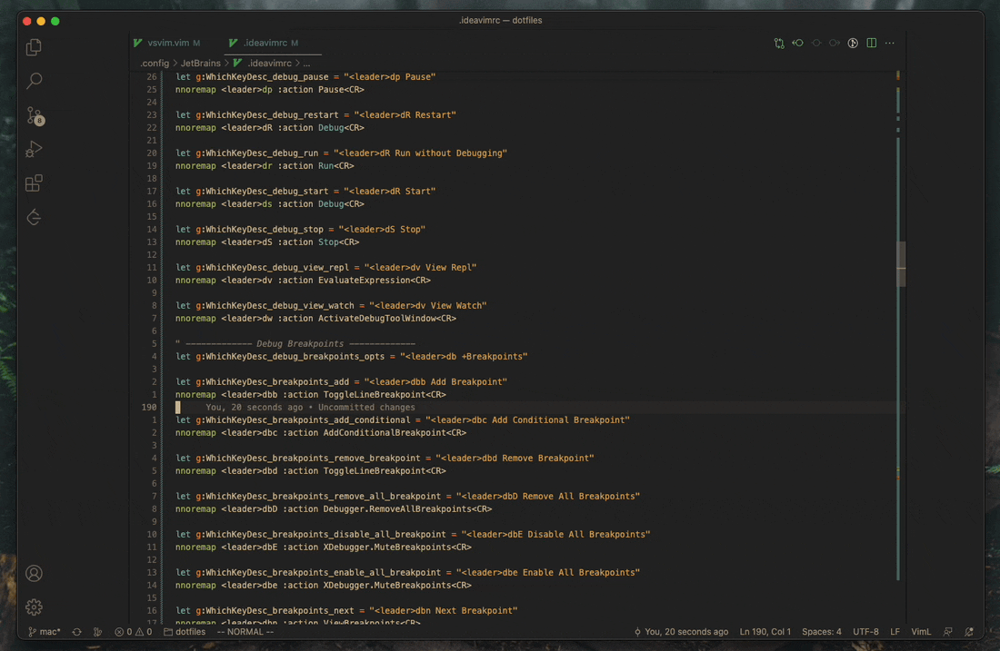
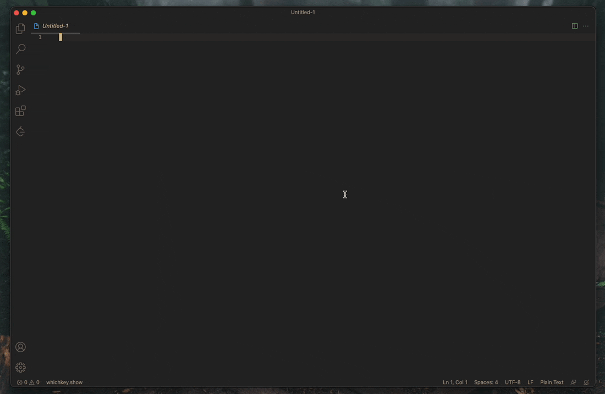
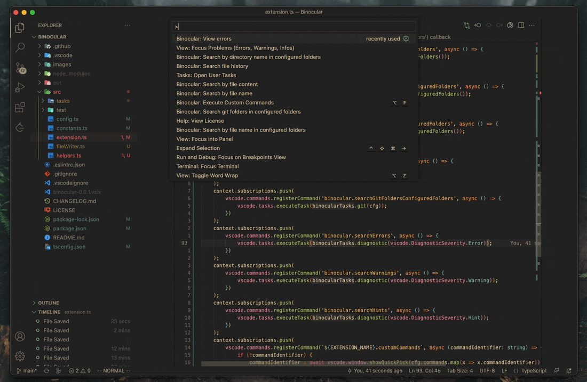

<p>
    <h1 align="center">Binocular</h1>
</p>

> Not as useful as a telescope, but helps in some situations.

This extension has a bunch of dependencies and there's no sanity checks, if the tools listed in the dependencies are not available in your PATH it'll just not work, sorry :(

- [What's Binocular?](#whats-binocular)
- [How does it work](#how-does-it-work)
- [Is this extension really necessary?](#is-this-extension-really-necessary)
- [Dependencies](#dependencies)
- [Installation](#installation)
- [Default Commands](#default-commands)
    - [Search file by name](#search-by-file-name)
    - [Search file by content](#search-by-file-content)
    - [Manage Workspace folders](#manage-workspace-folders)
- [Creating Shortcuts](#create-shortcuts)
- [External Terminal](#external-terminal)
- [Custom Commands](#custom-commands)
- [Current Problems](#current-problems)

## What's Binocular?
`Binocular` is an extension to execute shell commands inside vscode. It can be configured to execute any command, as explained in ([Custom Commands](#custom-commands)).
My main usage is to use it together with [Binocular-cli](https://github.com/jpcrs/binocular-cli) (The default commands in this extension), which is an opinionated wrapper around rg/fzf/fd/delta, mainly to search files and folders.

Inspired by [Telescope](https://github.com/nvim-telescope/telescope.nvim). But implemented with the quality of Internet Explorer 6.

Important: The code isn't tested or extensible enough to make this a serious extension. I just created this to help my current workflow whenever I have to use vscode. There's no guarantee to work for other people :).

## Is this extension really necessary?
Not really, everything that it does can be easily achieved with vscode [Tasks](https://code.visualstudio.com/docs/editor/tasks). But I wanted to do it so I can declutter my Tasks file, also the Tasks commands had to be different depending the OS that I'm using in the moment.

### Motivation?
My RSI.

## How does it work?
It's a simple wrapper around vscode **Tasks**. It runs a task with some specific command, send the task terminal to the editor and then close at the end of the execution.

## Dependencies
There are a bunch of hard dependencies to use the default commands:
- [binocular-cli](https://github.com/jpcrs/binocular-cli) (Wrapper around the other tools so it makes easier to compose the commands)
- [ripgrep](https://github.com/BurntSushi/ripgrep)
- [fzf v0.30.0](https://github.com/junegunn/fzf)
- [fd](https://github.com/sharkdp/fd) (**Important**: On Debian distros fd binary is actually called `fdfind`, but the default config uses `fd`. Create a Symbolic link `fd` or change the settings to `fdfind`).
- [bat](https://github.com/sharkdp/bat)
- [delta](https://github.com/dandavison/delta) (Used in the File History diff only)

## Installation
Currently `binocular-cli` is just available on crates.io, so cargo has to be installed. More information: https://doc.rust-lang.org/cargo/getting-started/installation.html

1. `cargo install binocular-cli`
2. Install all the other dependencies listed [HERE](#dependencies)

## Custom Commands
Binocular invoking lazygit:



You can create custom commands with the `binocular.command.commands` configuration and execute these commands with `binocular.customCommands`.

Some example of custom commands that I use:
```
"binocular.command.commands": [
    //lazygit! :)
    {
        "shellCommand": "lazygit",
        "commandIdentifier": "Lazygit"
    },
    // Search git log using the `git fuzzy` tool and checkout the selected one
    {
        "shellCommand": "git checkout $(git fuzzy log)",
        "commandIdentifier": "Git fuzzy log"
    },
    // Search git log for the current file using the `git fuzzy` tool and checkout the selected one
    {
        "shellCommand": "git checkout $(git fuzzy log ${file})",
        "commandIdentifier": "Git fuzzy log current file"
    }
],
```

## Creating shortcuts for custom commands
Since custom commands are defined in the config file, you have to parameterize the shortcut to send the commandIdentifier as parameter. Example:

keybindings.json:
```
    //Execute Lazygit command defined in binocular.command.commands settings.
    {
        "key": "alt+g",
        "command": "binocular.executeCommand",
        "args": "Lazygit"
    },
```

## Default Commands
`binocular.searchFile`: Search by file name
`binocular.searchFileContent`: Search by file content
`binocular.searchDirectory`: Search by directory name
`binocular.searchFileConfiguredFolders`: Search by file name in configured folders
`binocular.searchContentConfiguredFolders`: Search by file content in configured folders
`binocular.searchDirectoryConfiguredFolders`: Search by directory name in configured folders
`binocular.searchFileHistory`: Search file history
`binocular.searchGitFoldersConfiguredFolders`: Search git folders in configured folders
`binocular.searchErrors`: View errors
`binocular.searchWarnings`: View warnings
`binocular.searchHints`: View Hints
`binocular.customCommands`: Execute Custom Commands


## Settings
- `binocular.general.additionalSearchLocations`
Which folders are going to be used in the commands that uses "configured folders".
Example:
```
    "binocular.general.additionalSearchLocations": [
        
        "~/Projects",
        "~/.config"
    ]
```
- `binocular.command.commands`
Custom commands, [Example](#custom-commands).

- `binocular.general.keepTerminalPanelOpenAfterExecution`
If you want to keep the terminal open after the execution or not. Unfortunately the VSCode api doesn't expose if the bottom pane is open or not, so by default it's always closed.

## Demo
- ## Search File Local History


- ## Search by file name


- ## Search by file content


- ## Search directory by name (In pre-configured folders)


- ## Search for git projects (In pre-configured folders)


- ## Search for LSP Errors


## Current Problems
- Tests :)
- I don't really get how vscode timeline works, it's not exposed through their API, I don't want to save the whole history myself, so the History command is really unreliable.
- A lot of dependencies
- Everything else